<p align="center">
  
</p>

<h1 align="center">Relógio</h1>

<p align="center">App de relógio, alarmes, timers e cronômetro em React Native + Expo.</p>

## Telas

| Relógio | Alarmes | Editar alarme |
| :---: | :---: | :---: |
| 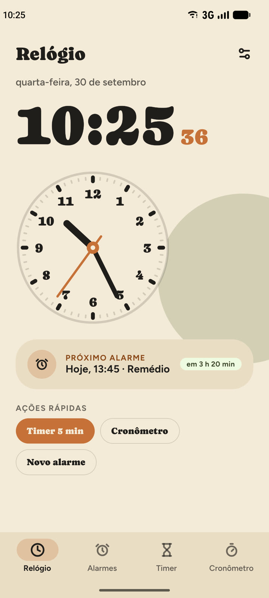 | 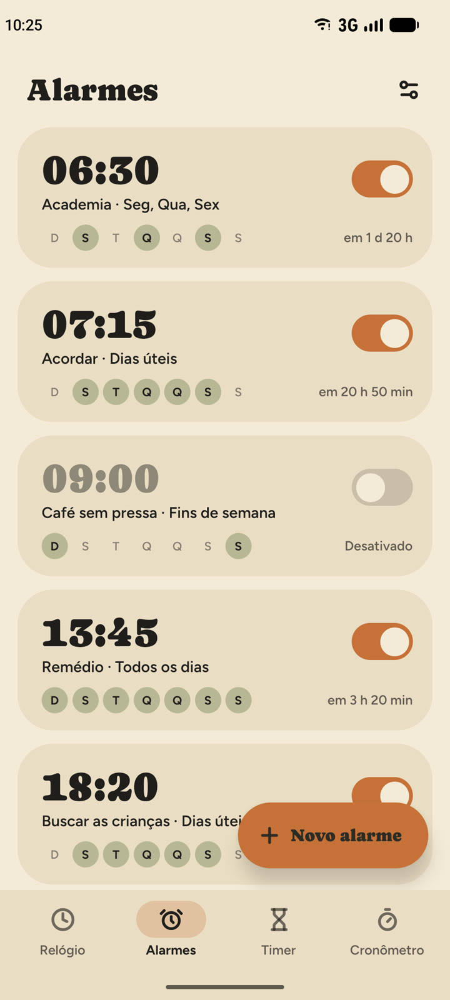 | 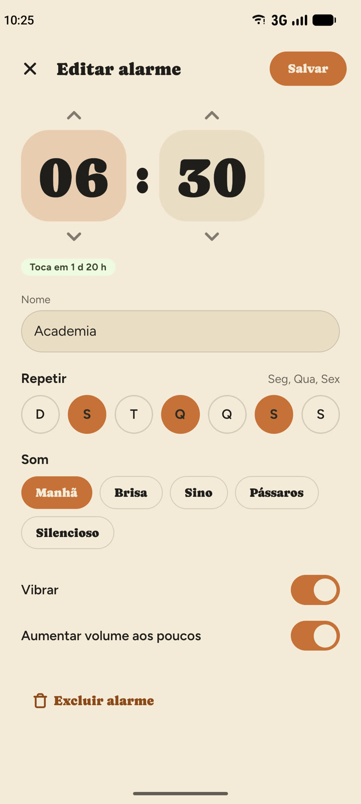 |

| Alarme tocando | Aviso de alarme | Notificações |
| :---: | :---: | :---: |
| 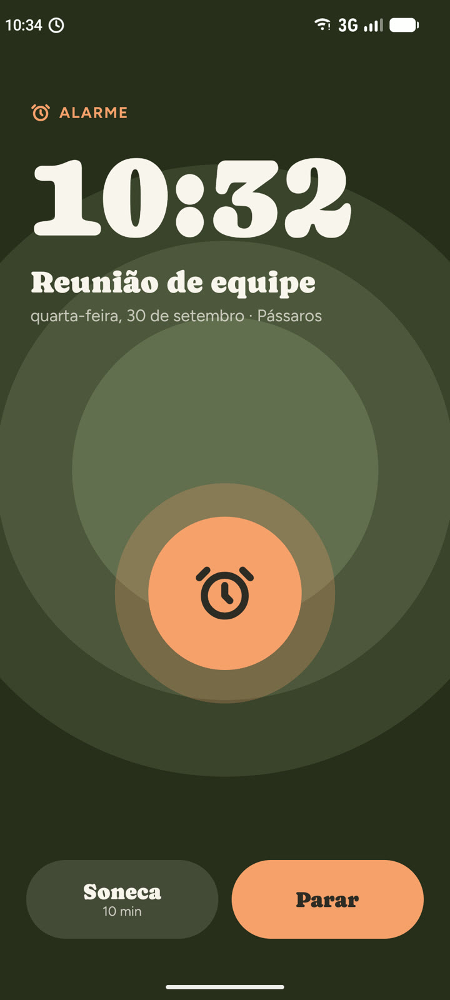 | 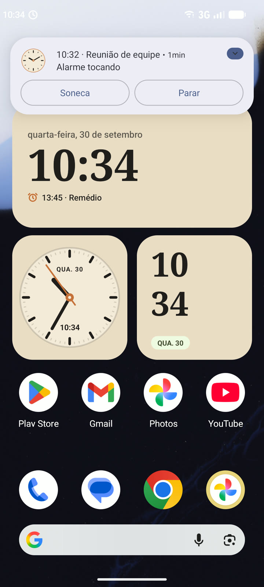 | 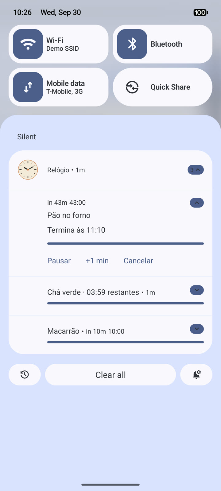 |

| Timers | Novo timer | Cronômetro |
| :---: | :---: | :---: |
| 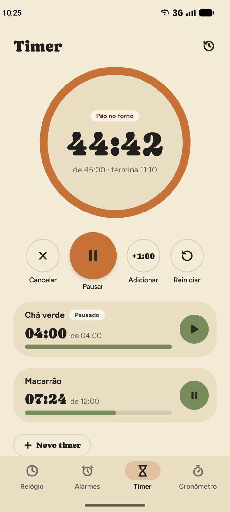 | 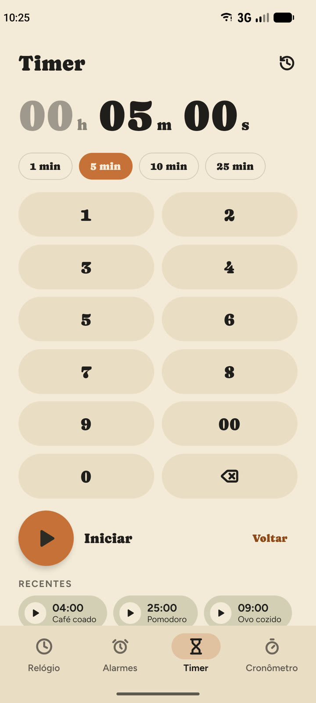 | 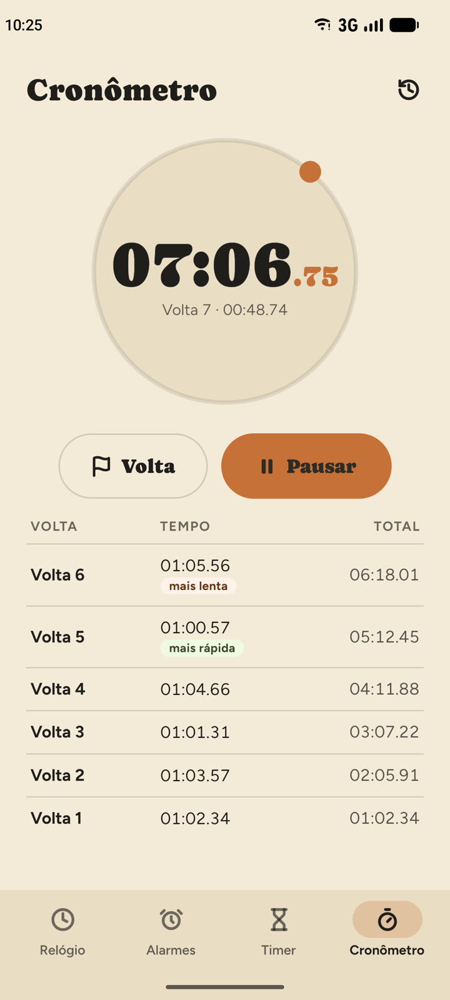 |

| Histórico | Configurações | Som do alarme |
| :---: | :---: | :---: |
| 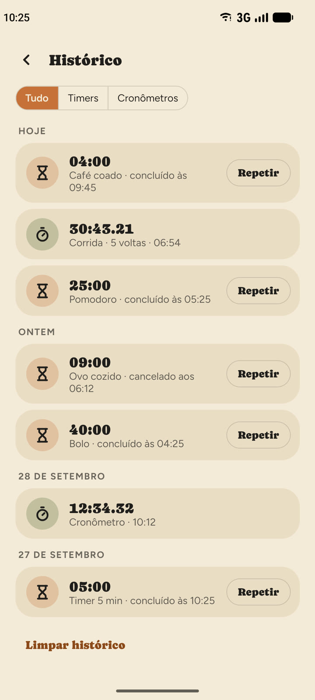 | 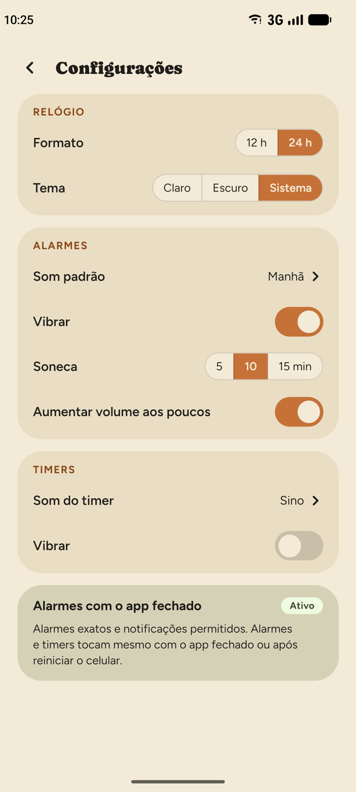 | 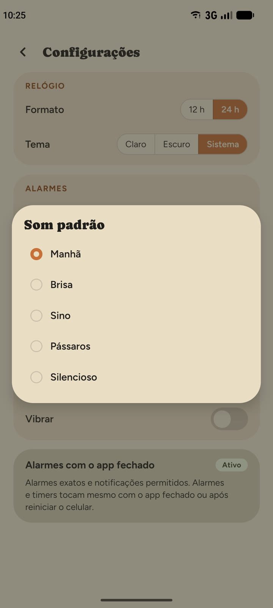 |

| Widgets | Tema escuro | Cronômetro escuro |
| :---: | :---: | :---: |
| 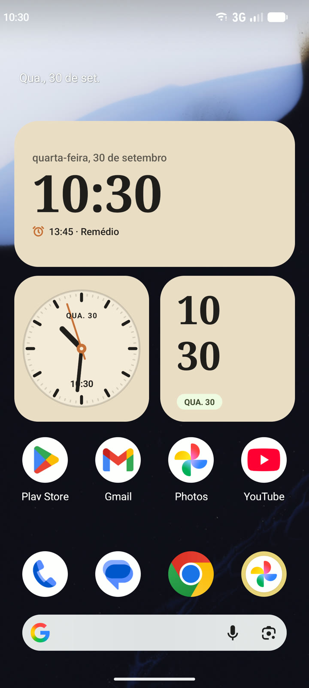 | 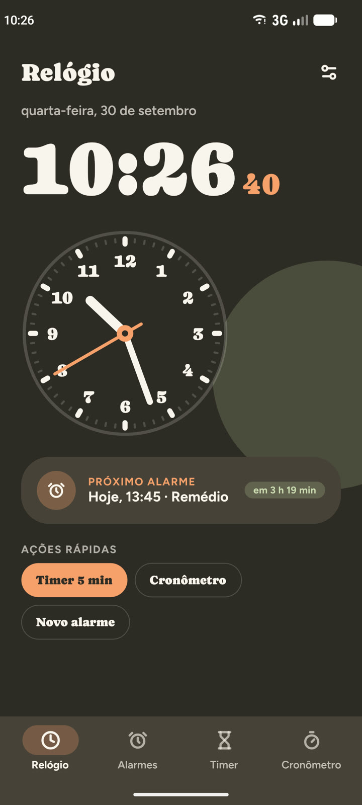 | 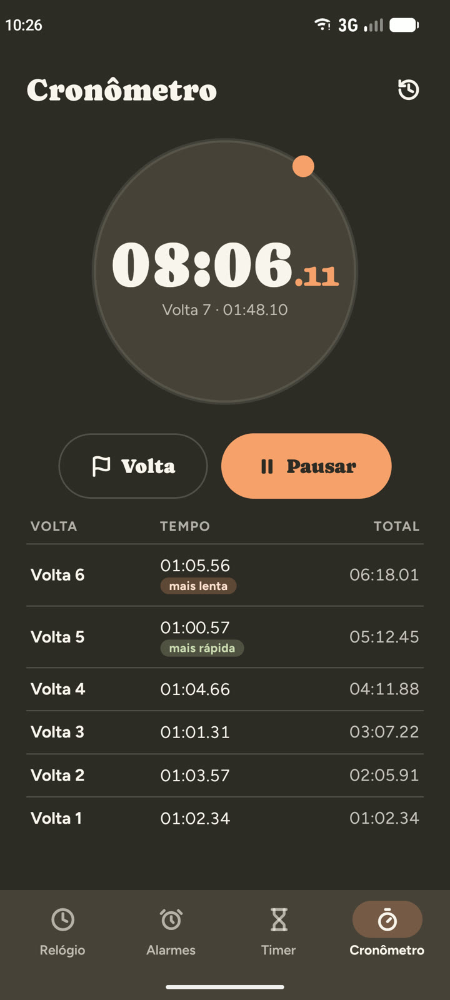 |

## Funcionalidades

- Relógio digital + analógico, data por extenso e próximo alarme
- Alarmes com nome, dias da semana, som, vibração e volume gradual. Tocam com o app fechado e depois de reiniciar o celular
- Tela cheia de alarme/timer por cima do bloqueio, com soneca e "+1 min"
- Vários timers ao mesmo tempo (pausar, +1 min, reiniciar), com notificação e ações
- Cronômetro com voltas (mais rápida/mais lenta) e notificação em andamento
- Histórico de timers e cronômetros, com "Repetir"
- 5 widgets de tela inicial (digital 4×2, analógico 2×2, digital 2×2, barra, analógico grande)
- Formato 12/24 h, tema claro/escuro/sistema, soneca 5/10/15 min

## Stack

- Expo SDK 57 + TypeScript, expo-router
- `modules/clock-native` — módulo Expo local em Kotlin: `AlarmManager` exato, serviço de toque, notificações, widgets, receivers de boot/fuso
- `react-native-svg` — relógio analógico e anel do timer
- `zustand` — alarmes, timers, cronômetro, histórico e ajustes (persistidos em AsyncStorage / armazenamento nativo)

## Rodar

Precisa de dev client (módulo nativo), Expo Go não serve.

```bash
npx expo run:android
```

Depois, só JS:

```bash
npx expo start --dev-client
```
